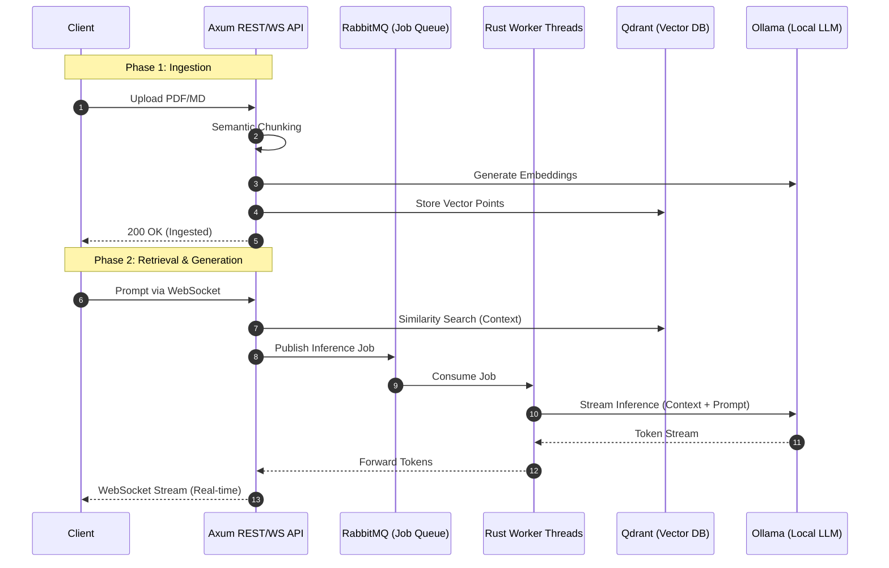

# Stardust RAG

[](https://hub.docker.com/r/vickystardust5/stardust)
[](LICENSE)
[]()
[](https://www.rust-lang.org/)

**Stardust RAG** is a high-performance, self-hosted Retrieval-Augmented Generation (RAG) engine designed for AI-powered SaaS. Built with **Rust**, it prioritizes low latency, minimal memory footprint, and horizontal scalability.

**[View Live Landing Page](https://thenameisvicky.github.io/stardust-ai/)**

---

## Architecture

Stardust RAG utilizes an asynchronous, event-driven architecture to handle high-concurrency LLM workloads. It decouples request handling from inference using a message queue, ensuring that the system remains responsive even under heavy load.

### System Sequence Diagram



---

## Benchmarks & Performance

Engineered for efficiency, Stardust RAG outperforms traditional Python-based RAG implementations in both resource consumption and throughput.

| Metric | Stardust RAG (Rust) | Typical Python RAG |
| :--- | :--- | :--- |
| **Idle RAM Footprint** | **~24 MB** | ~450 MB+ |
| **Peak RAM (Inference)** | **~256 MB** | ~1.2 GB+ |
| **Binary Size** | **~18 MB** | ~800 MB (incl. deps) |
| **Concurrency** | **Async/Non-blocking** | Thread-limited / Global Interpreter Lock |
| **Cold Start** | **< 1s** | 10s - 30s |

### Real-world Footprint

- **RAM Footprint**: Hard-capped at **256MB** in production containers.
- **Parallelism**: Native support for 3x parallel prompt processing per worker instance.
- **Streaming**: Full SSE (Server-Sent Events) and WebSocket support for ultra-low latency token delivery.

---

## Deployment (Docker)

Stardust RAG is designed to be **Docker-Native**. It can be deployed in minutes on any cloud provider or on-premise server.

### Quick Start with Docker

1. **Start Infrastructure**:

   ```bash
   # Vector Database
   docker run -d --name qdrant -p 6333:6333 -p 6334:6334 qdrant/qdrant

   # Message Queue
   docker run -d --name rabbitmq -p 5672:5672 rabbitmq:3-management

   # LLM Engine
   docker run -d --name ollama -p 11434:11434 ollama/ollama
   docker exec -it ollama ollama pull phi3:mini
   ```

2. **Run Stardust RAG**:

   ```bash
   docker run -it --rm \
     --network="host" \
     --memory="256m" \
     -e AMQP_HOST=127.0.0.1 \
     -e QDRANT_HOST=http://127.0.0.1:6334 \
     -e OLLAMA_HOST=http://127.0.0.1:11434 \
     vickystardust5/stardust:latest
   ```

---

## Development Setup

For developers looking to contribute or customize the engine.

### Prerequisites

- [Rust](https://rustup.rs/) (v1.75+)
- Docker (for dependencies)
- [Qdrant](https://qdrant.tech/)
- [RabbitMQ](https://www.rabbitmq.com/)
- [Ollama](https://ollama.com/)

### Local Installation

1. **Clone the repository**:

   ```bash
   git clone https://github.com/thenameisvicky/stardust-ai.git
   cd stardust-ai
   ```

2. **Environment Variables**:
   Create a `.env` file or export the following:

   ```bash
   export AMQP_HOST=127.0.0.1
   export QDRANT_HOST=http://127.0.0.1:6334
   export OLLAMA_HOST=http://127.0.0.1:11434
   ```

3. **Run the Engine**:

   ```bash
   cargo run --release
   ```

---

## For Founders & CTOs

Stardust RAG solves the "Cost of Intelligence" problem by providing a lean, scalable, and self-hosted alternative to expensive managed RAG services.

- **Zero Licensing Fees**: 100% Open Source.
- **Data Sovereignty**: Your data never leaves your infrastructure.
- **Cost Efficiency**: Run your entire RAG pipeline on a $5/mo VPS.

---

Built with Rust by **[Vicky](https://github.com/thenameisvicky)**
