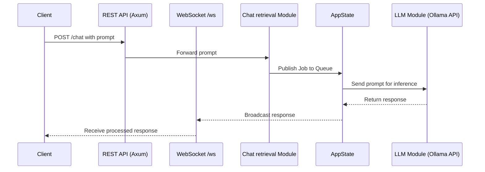

# Stardust RAG

Self-hosted, streaming RAG engine for AI-powered SaaS.

## Architecture



## Deployment

### GitHub Pages (Landing Page)
The landing page located in `src/views` is automatically deployed to GitHub Pages via the `Production-Client` workflow.

### Docker (Backend Service)
The backend service is built and pushed to Docker Hub via the `Production-Docker` workflow.

### Repository Secrets
To enable automated deployments, set the following secrets in your GitHub repository:
- `DOCKER_USERNAME`: Your Docker Hub username.
- `DOCKER_PASSWORD`: Your Docker Hub personal access token.
- `DEPLOYMENT_EMAIL`: Authorized email for triggering production workflows.

## Development

```bash
# Run locally
cargo run
```
